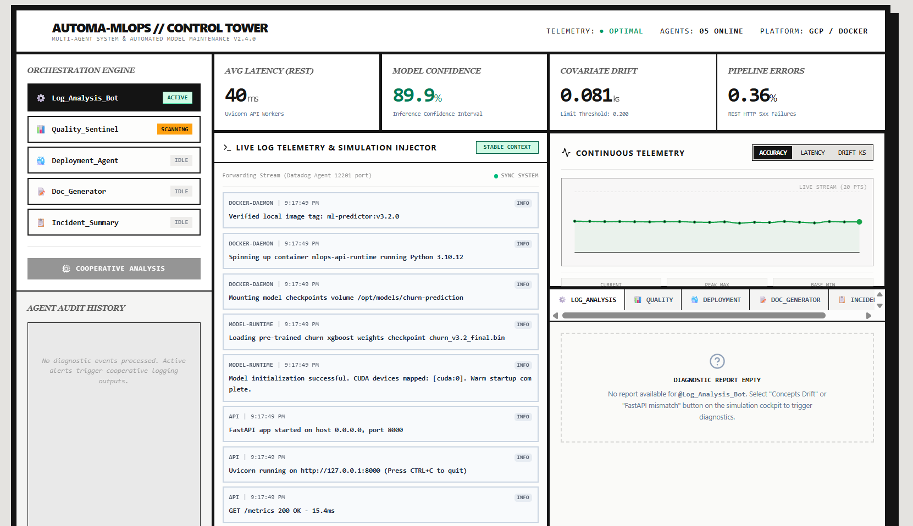
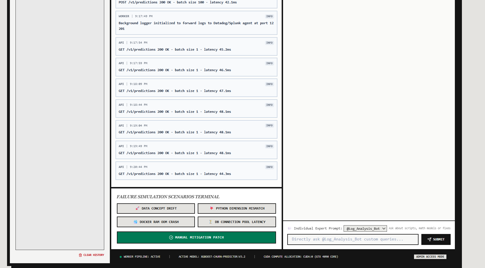

🤖 AUTOMA — Multi-Agent MLOps Automation System

### Automated ML Operations, Multi-Agent Monitoring & Model Maintenance using Python, Docker, REST APIs & Logging Frameworks

An intelligent MLOps automation platform designed to monitor, maintain, diagnose, and automate deployed machine learning systems using specialized multi-agent workflows for deployment, model quality monitoring, anomaly detection, incident summarization, and documentation.

</div>

<br>

<p align="center">
  
  
  
  
  
</p>

---

🚀 Business Problem

Managing deployed ML systems is difficult because teams struggle with:

✨ Monitoring model performance degradation  

✨ Detecting model drift automatically  

✨ Investigating deployment failures  

✨ Root cause analysis from logs  

✨ Maintaining operational ML reliability

Traditional MLOps monitoring is reactive and heavily manual.

The **AUTOMA System** solves this by introducing **specialized AI-driven operational agents** that continuously monitor deployed ML systems, diagnose failures, analyze telemetry, and automate maintenance workflows.

---

🎯 Project Objectives

✅ Automate ML system maintenance  

✅ Detect anomalies in deployed systems  

✅ Monitor model quality degradation  

✅ Surface root causes automatically  

✅ Improve deployment reliability  

✅ Reduce manual operational effort

---

🛠️ Tech Stack

| Technology | Purpose |
|------------|----------|
| Python | Agent orchestration |
| Docker | Containerized deployment |
| REST APIs | Service communication |
| Logging Frameworks | Telemetry monitoring |
| FastAPI | API services |
| Multi-Agent Architecture | Workflow automation |
| Monitoring Systems | Performance tracking |
| Incident Analysis | Root cause detection |

---

📊 Multi-Agent Control Tower Dashboard

The control tower provides centralized monitoring across deployed ML services and operational agents.

Key monitored indicators:

✨ Model confidence tracking  

✨ API latency monitoring  

✨ Covariate drift detection  

✨ Pipeline error tracking  

✨ Agent health monitoring

Specialized automation agents include:

✅ Log Analysis Bot  

✅ Quality Sentinel  

✅ Deployment Agent  

✅ Documentation Generator  

✅ Incident Summary Agent

<br>

<p align="center">
  
</p>

---

📡 Live Telemetry & Simulation Monitoring

The platform continuously monitors logs, model services, and deployment telemetry.

Capabilities include:

✨ Real-time API monitoring  

✨ Deployment telemetry tracking  

✨ Log anomaly detection  

✨ Automated diagnostics  

✨ Failure scenario simulation

Business value:

✅ Faster debugging  

✅ Reduced downtime  

✅ Automated system monitoring  

✅ Faster operational insights

<br>

<p align="center">
  
</p>

---

🧠 Multi-Agent Automation System

The system orchestrates multiple agents to automate ML maintenance workflows.

Agent responsibilities:

✅ Deployment monitoring  

✅ Log anomaly detection  

✅ Model quality tracking  

✅ Documentation generation  

✅ Incident summarization

This enables:

✨ Autonomous operational workflows  

✨ Continuous system diagnostics  

✨ Faster root cause analysis  

✨ Automated maintenance intelligence

---

📉 Model Monitoring & Drift Detection

The platform tracks ML system health in real time.

Monitoring capabilities:

✨ Accuracy tracking  

✨ Confidence monitoring  

✨ Latency analysis  

✨ Covariate drift detection  

✨ Failure alerting

The system automatically flags:

✅ Model confidence degradation  

✅ Data drift anomalies  

✅ Pipeline instability  

✅ Latency spikes

---

📌 Key Features

✨ Multi-Agent MLOps Automation  

✨ Real-Time Telemetry Monitoring  

✨ Automated Root Cause Detection  

✨ Model Drift Detection  

✨ Deployment Monitoring  

✨ Incident Summarization  

✨ Log Intelligence Engine  

✨ Failure Simulation Framework  

✨ Automated Diagnostics Dashboard

---

📊 Business Impact

✅ Reduced manual monitoring effort  

✅ Faster ML incident diagnosis  

✅ Improved deployment reliability  

✅ Automated model quality tracking  

✅ Better operational visibility

---

🧠 MLOps Concepts Used

```python
MLOps Automation
Model Monitoring
Covariate Drift Detection
Incident Analysis
Root Cause Detection
Telemetry Monitoring
Observability
Multi-Agent Systems
Failure Simulation
Real-Time Diagnostics
```

---

🧠 System Components

```yaml
Multi-Agent Architecture
Dockerized Services
REST API Monitoring
Telemetry Pipelines
Log Analysis Engine
Model Quality Tracking
Deployment Monitoring
Incident Summarization
```

---

📌 Future Enhancements

✨ Automated model retraining  

✨ CI/CD integration for ML pipelines  

✨ Distributed orchestration agents  

✨ Kubernetes deployment support  

✨ Predictive incident prevention

---

👩‍💻 Author

**Sankeerthana Verneni**

Aspiring MLOps Engineer • ML Systems • Automation • AI/ML
